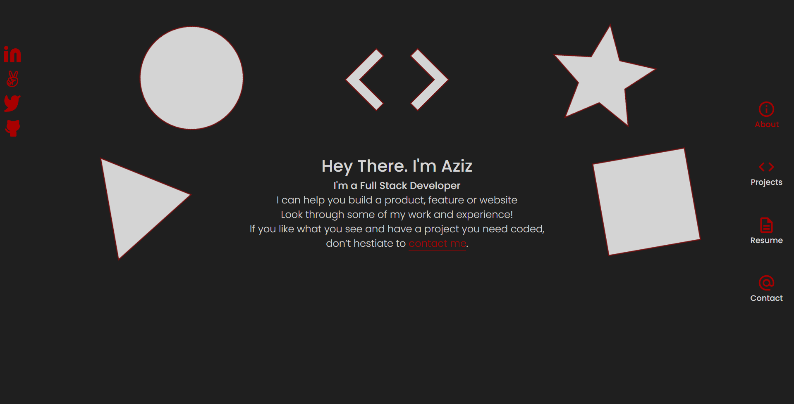

# Portfolio

> This is a a portfolio to show case my projects

## Built With

- HTML
- CSS
- SCSS
- JavaScript
- React
- GitHub API

## Live Link

[spayco.dev](https://spayco.dev/)

## Getting Started

- `npm install`
- `npm run dev`

## Author

👤 **SpaYco**

- Github: [@SpaYco](https://github.com/SpaYco)
- Twitter: [@iSpaYco](https://twitter.com/iSpaYco)
- Linkedin: [Aziz Mejri](https://linkedin.com/in/spayco)

## Credits

Favicon made by <a href="https://www.flaticon.com/authors/freepik" title="Freepik">Freepik</a> from <a href="https://www.flaticon.com/" title="Flaticon">www.flaticon.com</a>

## Show your support

Give a ⭐️ if you like this project!

## 📝 License

This project is [MIT](lic.url) licensed.
