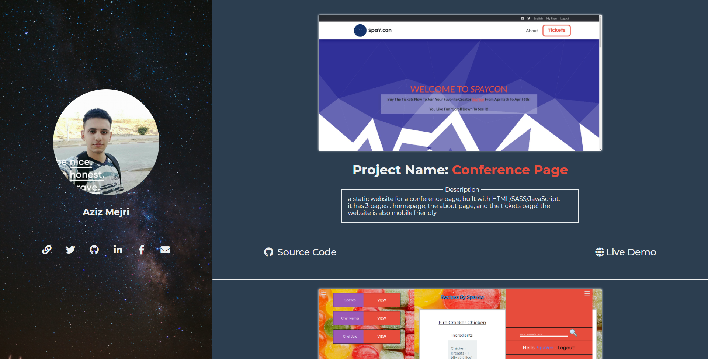

# Project Name

> Portfolio.

This Is My Personal Portfolio

## Built With

- HTML
- CSS

## Live Demo

[Live Demo Link](https://spayco.github.io/Portfolio)

### Usage

- open index.html file

## Authors

👤 **SpaYco**

- Github: [@SpaYco](https://github.com/SpaYco)
- Twitter: [@iSpaYco](https://twitter.com/iSpaYco)
- Linkedin: [Aziz Mejri](https://www.linkedin.com/in/spayco/)

## 🤝 Contributing

Contributions, issues, and feature requests are welcome!

Feel free to check the [issues page](issues/).

## Show your support

Give a ⭐️ if you like this project!
## 📝 License

This project is [MIT](LICENSE) licensed.
